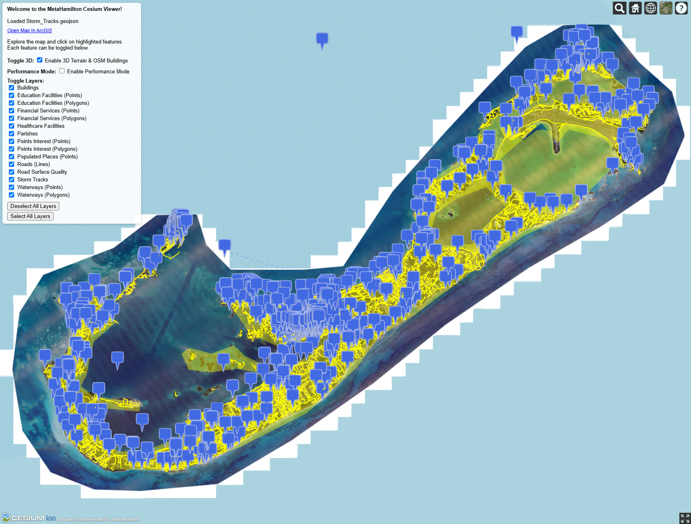

# MetaHamilton Cesium Viewer

A web-based interactive 3D map viewer built with [CesiumJS](https://cesium.com/cesiumjs/). Explore terrain, buildings, and a variety of geographic layers for the MetaHamilton area.



---

## Features

- 3D terrain using Cesium World Terrain
- OpenStreetMap imagery
- 3D buildings (OSM Buildings)
- Toggleable GeoJSON layers for:
  - Buildings
  - Education facilities
  - Financial services
  - Healthcare facilities
  - Points of interest
  - Roads and waterways
- Performance mode for lower-spec machines
- Interactive selection highlights for polygons, polylines, and billboards

---

## Live Demo

[View on GitHub Pages](https://harry-ellis2.github.io/MetaHamilton/)

---

## Installation / Running Locally

1. Clone the repository:

```bash
git clone https://github.com/harry-ellis2/MetaHamilton.git
cd meta-hamilton-cesium
```

## Start a local HTTP server:
Python 3.x
`python -m http.server 8000`

Open a browser and navigate to: http://localhost:8000/